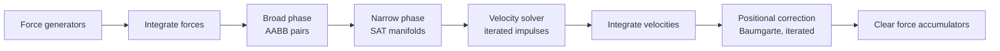

# Architecture & the step pipeline

The engine is organized around a single `World` that owns the bodies and force
generators and advances the simulation with `World.Step(dt)`. Everything else is a
collaborator the world drives in a fixed order.

## The step pipeline

Each call to `World.Step(dt)` runs the following pipeline:



In ASCII, matching the engine's own diagram:

```
┌─────────────┐   ┌──────────────┐   ┌──────────────┐   ┌──────────────────┐   ┌───────────┐
│  Forces     │ → │  Integrate   │ → │  Broad phase │ → │  Narrow phase    │ → │  Solver   │
│ generators  │   │  forces      │   │  (AABB pairs)│   │  (SAT manifolds) │   │ (impulse) │
└─────────────┘   └──────────────┘   └──────────────┘   └──────────────────┘   └───────────┘
                                                                                      ↓
                                          ┌──────────────┐   ┌──────────────────────────┐
                                          │ Integrate    │ ← │ Positional correction    │
                                          │ velocities   │   │ (Baumgarte)              │
                                          └──────────────┘   └──────────────────────────┘
```

## Step by step

The order below is exactly what `World.Step(dt)` executes (it returns early if
`dt <= 0`):

1. **Apply force generators.** Each registered `IForceGenerator` runs once, accumulating
   forces/torques onto bodies via `body.ApplyForce*`.
2. **Integrate forces into velocities.** `Integrator.IntegrateForces` adds gravity (an
   acceleration) plus the accumulated force/inverse-mass and torque/inverse-inertia,
   using semi-implicit (symplectic) Euler.
3. **Broad phase.** `BroadPhase.Build(bodies)` rebuilds the acceleration structure, then
   `BroadPhase.FindPairs()` yields candidate pairs whose AABBs overlap.
4. **Narrow phase.** For each candidate pair, `CollisionDetector.Collide` produces a
   `Manifold` (normal, penetration, 1–2 contacts). Manifolds with at least one contact
   are kept for this step.
5. **Velocity solver (iterated).** For `Settings.VelocityIterations` passes,
   `CollisionResolver.ResolveVelocity` applies normal (restitution) and tangential
   (Coulomb friction) impulses for every manifold.
6. **Integrate velocities into positions.** `Integrator.IntegrateVelocity` advances
   position/rotation from the updated velocities and applies linear/angular damping.
7. **Positional correction (iterated).** For `Settings.PositionIterations` passes,
   `CollisionResolver.CorrectPositions` removes residual penetration beyond the slop
   (Baumgarte-style).
8. **Clear force accumulators.** Each body's `Force` and `Torque` are reset to zero.

After the pipeline, the world raises its `CollisionsResolved` event with the contacts
found that step (useful for rendering or QA).

## Module map

| Concern | Type(s) |
|---|---|
| Simulation container | `World`, `WorldSettings` |
| Bodies & state | `RigidBody`, `BodyType`, `Material` |
| Shapes | `Shape`, `CircleShape`, `PolygonShape`, `MassData`, `ShapeType` |
| Math | `Vector2`, `Transform`, `AABB`, `MathUtils` |
| Narrow phase | `CollisionDetector`, `Manifold` |
| Broad phase | `IBroadPhase`, `BruteForceBroadPhase`, `SpatialHashBroadPhase`, `SweepAndPruneBroadPhase` |
| Solver | `Integrator`, `CollisionResolver` |
| Forces | `IForceGenerator` + seven generators |

These collaborators communicate only through small, stable contracts (`IBroadPhase`,
`IForceGenerator`, `Manifold`), which is why broad phases and force generators are
hot-swappable at runtime.
